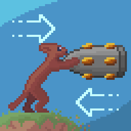

  
  <h1>Create Big Cannons: Equally Opposite</h1>

For every action, there is an equal and opposite reaction. This mod lets cannons and projectiles from Create: Big Cannons apply forces to Sable physics objects.
